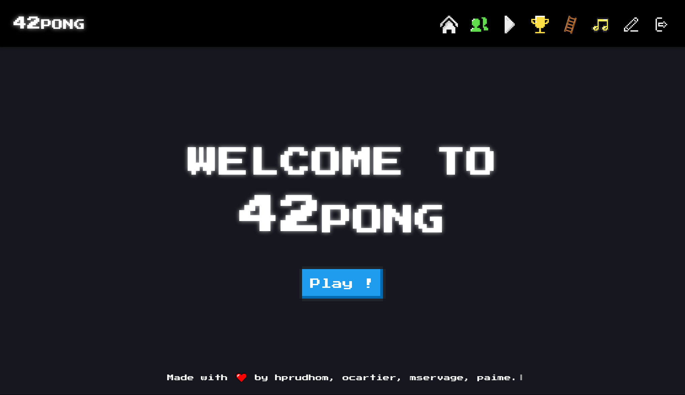
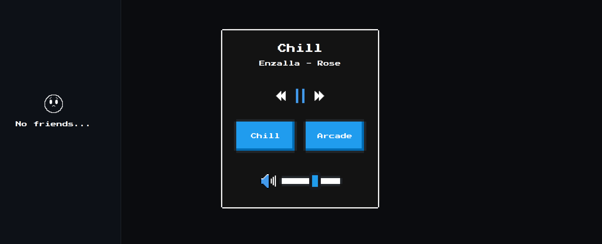
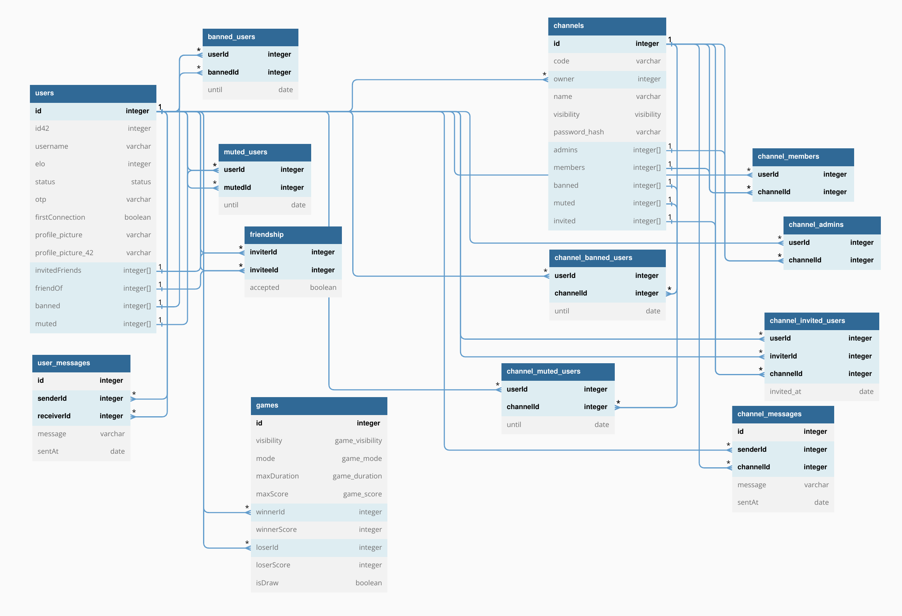

# ft_transcendence

4 people to work on 42's first web development project. The objective: to create an online multiplayer Pong with chat (friends, channels) and matchmaking functionalities (+ a few bonuses from us).



Despite time constraints, we paid particular attention to the design and user interface, as well as the backend and database architecture.


## Database structure



**Give it a try!**
## Usage

Create a `.env` file at the base of the project (next to the `docker-compose.dev.yml`)

Generate the secrets with `openssl rand -hex 16`.

```env
DB_NAME=transcendence
DB_USER=transcendence
DB_PASS=transcendence

# Optionnal section, only if you want 42 intra Oauth
API42_CLIENT_ID=<your 42 app client ID>
API42_CLIENT_SECRET=<your 42 app client SECRET>
API42_REDIRECT_URI=http://api.transcendence.local/api/v1/auth/42oauth

JWT_SECRET=<a random string>
TOTP_SECRET=<a random string>
COOKIE_SECRET=<a random string>

COOKIE_DOMAIN=.transcendence.local
FRONTEND_URL=http://transcendence.local
API_URL=http://api.transcendence.local/api/v1
SOCKET_URL=http://api.transcendence.local

NGINX_SERVER_NAME_BACK=api.transcendence.local
NGINX_SERVER_NAME_FRONT=transcendence.local

CORS_ORIGIN=http://transcendence.local
```

Edit the `/etc/hosts` file on your system to include:

```
127.0.0.1    api.transcendence.local
127.0.0.1    transcendence.local
```

Then, you then start the docker containers!

```bash
docker-compose up --build
```

You will be able to access the web app by visiting `http://transcendence.local`
